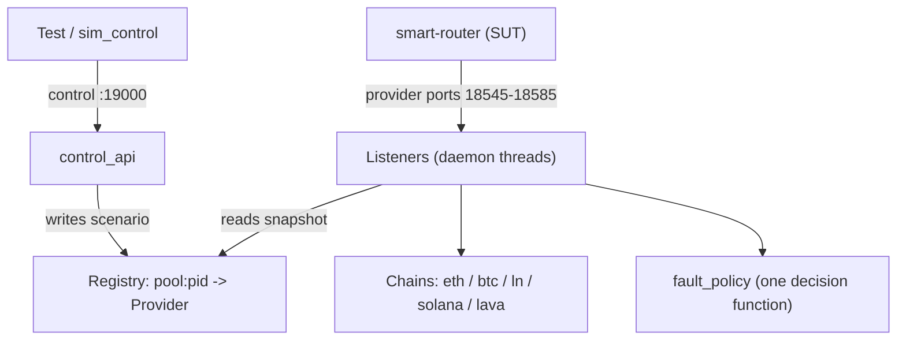

# Provider Simulator

Fake blockchain providers for testing the smart-router. The router talks to this
simulator instead of real nodes, so a test can make a provider go **down**,
**stall**, **return errors**, or **fall behind** — on demand, deterministically —
then check how the router reacts.

It runs as **one Python process**: many listeners (JSON-RPC, REST, gRPC,
Tendermint RPC, WebSocket) plus a control API, all over one in-memory registry
of providers.

## Architecture

Two planes over one registry. Tests **write** provider config on the control
plane; the router **reads** it on the data plane. A change is instant — no
restart, no IPC.



- Identity is **`pool:pid`** — one provider is one named node in one router's
  pool (e.g. `eth-sim:1`). Two chains never share a provider, so a fault on one
  chain can never leak onto another.
- Each listener owns one **port**; the port resolves through the registry to a
  provider + endpoint. The provider's **chain** builds the success response, and
  one **`fault_policy`** decides every fault.

## Run it locally

Python 3.12. gRPC needs `grpcio` / `grpcio-reflection` / `protobuf`; the
JSON-RPC side is standard-library only.

```bash
pip install -r requirements.txt
python -u run.py
```

Smoke it:

```bash
curl -s http://localhost:19000/health
curl -s -X POST http://localhost:18545 -H "Content-Type: application/json" \
  -d '{"jsonrpc":"2.0","method":"eth_blockNumber","params":[],"id":1}'
grpcurl -plaintext localhost:18548 list
```

Run the tests (they boot the server in-process on isolated ports):

```bash
pytest tests/ -v
```

Lint, format, and type-check (CI runs all three):

```bash
black --check . && ruff check . && mypy .
```

## Ports & dispatch

Each row is a group of 3 providers. The port resolves to a `pool:pid` provider.

| Surface | Ports (primary / backup / solo) | Pool |
|---|---|---|
| ETH JSON-RPC | 18545–47 / 18560–62 / 18581 | `eth-sim` (pids 1–6) / `eth-solo-sim` |
| ETH WebSocket | 18557–59 / 18572–74 | `eth-sim` (same providers, ws endpoint) |
| BTC JSON-RPC | 18575–77 | `btc-sim` |
| LN JSON-RPC | 18578–80 | `ln-sim` |
| Solana JSON-RPC | 18582–84 / 18585 | `solana-sim` / `solana-solo-sim` |
| gRPC | 18548–50 / 18563–65 | `lava-sim-grpc` |
| REST | 18551–53 / 18566–68 | `lava-sim-rest` |
| Tendermint RPC | 18554–56 / 18569–71 | `lava-sim-tm` |
| Control API | 19000 | `control_api` |

## Providers & state

- A **provider** is one fake node, addressed **`pool:pid`** (e.g. `eth-sim:1`).
  Its behaviour lives in a `ScenarioConfig` (fault mode, latency, error shape,
  per-method overrides) plus typed per-chain `Quirks`; its telemetry lives in a
  `CallLog`. Nothing is shared with any other provider.
- One ETH provider serves two endpoints under one identity — http and ws — so a
  `down` on `eth-sim:1` covers both. REST / gRPC / Tendermint are separate pools
  (`lava-sim-rest` / `-grpc` / `-tm`), so faulting one never touches another.
- `snapshot()` gives each request a stable read; `update()` applies a `/scenario`
  change under a lock.

**Scope a fault with `transports`, not `chain_family`.** A scenario block's
optional `transports` list (e.g. `["ws"]`) scopes its effect to specific
endpoints of the provider; omit it and the block covers every endpoint. There is
no `chain_family` field any more — the pool already fixes the chain.

**`down` is provider-wide by default.** A provider set to `down` returns 503 on
all of its endpoints — a dead node is unreachable on every port. This is the
natural default now, not a special case.

## Fault primitives

Pick one `mode`; combine it with the orthogonal fields.

| Field | Values | Effect |
|---|---|---|
| `mode` | `success` \| `error` \| `rate_limit` \| `down` \| `hang` \| `drop_connection` | Primary behaviour |
| `latency_ms` | int | Sleep N ms before responding |
| `error_probability` | 0.0–1.0 | Random error on top of `success` |
| `error_code` / `error_message` / `http_status` | int / str / int | Customise the error returned |
| `corruption_mode` | `truncated` \| `invalid_json` \| `empty_response` \| `missing_field` \| `wrong_type` | Break the response body |
| `missing_field` | str | Which field to drop or retype |
| `blocks_behind` | int | Report a stale head (`eth_blockNumber` / `eth_getBlockByNumber` / gRPC `GetLatestBlock`) |
| `drop_at` | `before_headers` \| `after_headers` \| `mid_body` | Where `drop_connection` cuts the socket |
| `fail_first_n` / `then_mode` | int / mode | Fail the first N calls, then switch to `then_mode` |
| `transports` | list of `http` / `http2` / `ws` | Scope the block to specific endpoints (omit = all) |

## Control API (port 19000)

| Route | Purpose |
|---|---|
| `POST /scenario` | Set per-provider behaviour, keyed `pool:pid`: `{"providers": {"eth-sim:1": {"mode": "down"}}}`. An old bare-pid key or a `chain_family` field gets a 400 naming the new format. |
| `POST /reset` | Reset scenario config, keep history |
| `POST /history/clear` | Clear history, keep config |
| `POST /reset/all` | Reset both |
| `POST /advance` | Move a chain's simulated head (default `eth`; sync-freshness tests) |
| `POST /ws/emit` | Push a WebSocket event to a live subscription |
| `GET /health` · `/ready` · `/scenario` · `/stats` · `/history` · `/ws/subscriptions` | Health / readiness (all listener ports bound) / config / counters / call log / live subscriptions |

`GET /history` merges every provider's ring buffer, sorts by time, and adds
`correlation_group` (the calls of one router relay) and `call_order`. Each entry
carries `pool` / `pid` / `interface` / `transport` / `port`; filter by
`pool` / `transport` / `method` / `status` / `request_id` / time / `lava_header_*`.

## Deploy

- `scripts/deploy.sh` — build the image, import it, apply the manifests, and
  rollout-restart. The image tag is always `:latest` with
  `imagePullPolicy: IfNotPresent`, so the restart is what makes the new image
  take effect.
- Public URLs derive from `BASE_DOMAIN` in `config/base-domain.env`:
  `sim-control.<BASE_DOMAIN>`, `eth-sim-jsonrpc.<BASE_DOMAIN>`,
  `lava-sim-grpc.<BASE_DOMAIN>:443`.
- The deployment is intentionally **1 replica** — history and counters live in
  memory, so a second pod would split the state.

## Docs

- **[docs/START_HERE.md](docs/START_HERE.md)** — index / learning path.
- **[docs/new_server_setup.md](docs/new_server_setup.md)** — fresh-server setup, verification, router wiring, debug domain.
- **[docs/using_the_simulator.md](docs/using_the_simulator.md)** — scenarios, resets, history, fault primitives, with paste-ready examples.
- **[docs/using_grpc.md](docs/using_grpc.md)** — gRPC quickstart, reflection, fault injection, troubleshooting.
- **[docs/curl_reference.md](docs/curl_reference.md)** — full curl catalogue for the JSON-RPC surface.
- **[docs/ARCHITECTURE_GUIDE.md](docs/ARCHITECTURE_GUIDE.md)** · **[docs/CLASS_REFERENCE.md](docs/CLASS_REFERENCE.md)** · **[docs/DATA_FLOWS.md](docs/DATA_FLOWS.md)** — deeper code walkthroughs.
- **[docs/kubectl_reference.md](docs/kubectl_reference.md)** · **[docs/DEPLOY_AFTER_PUSH.md](docs/DEPLOY_AFTER_PUSH.md)** — cluster ops.

## Repo layout

```
run.py                        — entry point
server.py                     — bootstrap: build the registry from TOPOLOGY, bind listeners to ports
provider_simulator/
  topology.py                 — the pool / provider / endpoint table
  fault_policy.py             — the one fault-decision function
  domain/                     — Endpoint, ScenarioConfig, Quirks, CallLog, Pool/Provider, Registry
  chains/                     — one class per chain (eth/btc/solana/ln/lava)
  listeners/                  — base template + jsonrpc/rest/tendermint, a gRPC adapter, a WS
                                subscription registry, and the corruption serializer
  control_api.py              — the port-19000 routes over the registry
stubs*.py                     — default success payloads per surface (eth/btc/ln/solana/rest/tm/ws)
constants.py                  — port maps, chain constants, history caps
cosmos_pb2/                   — vendored Cosmos protobufs
config/base-domain.env        — BASE_DOMAIN for deploy
config/values_sim.yml         — smart-router Helm values that wire the sim in
Dockerfile                    — image used by scripts/deploy.sh
k8s/                          — Deployment, Service, HTTPRoute, GRPCRoute
scripts/deploy.sh             — build / import / apply / restart
tests/                        — pytest suite (all surfaces, in-process)
```
