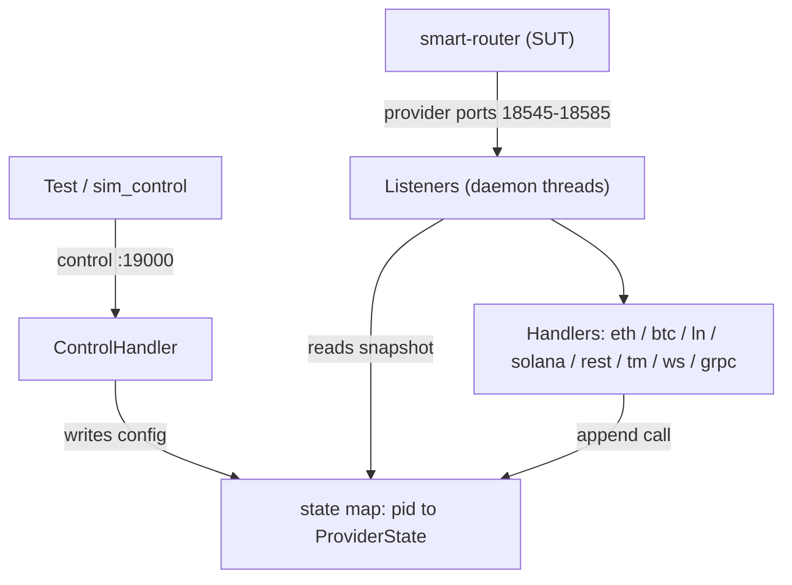

# Provider Simulator

Fake blockchain providers for testing the smart-router. The router talks to this
simulator instead of real nodes, so a test can make a provider go **down**,
**stall**, **return errors**, or **fall behind** — on demand, deterministically —
then check how the router reacts.

It runs as **one Python process**: many listeners (JSON-RPC, REST, gRPC,
Tendermint RPC, WebSocket) plus a control API, all sharing one in-memory state
map.

## Architecture

Two planes over one shared state map. Tests **write** provider config on the
control plane; the router **reads** it on the data plane. A change is instant —
no restart, no IPC.



- Each listener owns one **port**, and the port decides which **handler** runs.
- One `ProviderState` is created per provider id at startup, shared across every
  surface that provider serves.

## Run it locally

Python 3.12. gRPC needs `grpcio` / `grpcio-reflection` / `protobuf`; the
JSON-RPC side is standard-library only.

```bash
pip install -r requirements.txt
python -u run.py
```

Smoke it:

```bash
curl -s http://localhost:19000/health
curl -s -X POST http://localhost:18545 -H "Content-Type: application/json" \
  -d '{"jsonrpc":"2.0","method":"eth_blockNumber","params":[],"id":1}'
grpcurl -plaintext localhost:18548 list
```

Run the tests (they boot every listener in-process on isolated ports):

```bash
pytest tests/ -v
```

Lint, format, and type-check (CI runs all three):

```bash
black --check . && ruff check . && mypy .
```

## Ports & dispatch

Each row is a group of 3 providers (pids 1–3). The port picks the handler.

| Surface | Ports (primary / backup / solo) | Handler |
|---|---|---|
| ETH JSON-RPC | 18545–47 / 18560–62 / 18581 | `handlers_eth` |
| BTC JSON-RPC | 18575–77 | `handlers_btc` |
| LN JSON-RPC | 18578–80 | `handlers_lnd` |
| Solana JSON-RPC | 18582–84 / 18585 | `handlers_solana` |
| gRPC | 18548–50 / 18563–65 | `handlers_grpc` |
| REST | 18551–53 / 18566–68 | `handlers_rest` |
| Tendermint RPC | 18554–56 / 18569–71 | `handlers_tendermintrpc` |
| WebSocket | 18557–59 / 18572–74 | `handlers_ws` |
| Control API | 19000 | `ControlHandler` |

## Providers & state

- A **provider** is one fake node, addressed by id (`"1"`, `"2"`, `"3"`). Its
  behaviour lives in one `ProviderState`: fault mode, latency, error shape,
  per-method overrides, history, and counters.
- For pids 1–3, the primary listeners of every surface **share one
  `ProviderState`**, so a single `POST /scenario` on pid `1` reconfigures that
  provider on every transport at once.
- `snapshot()` gives each request a stable read; `update()` applies a
  `/scenario` change under a lock.

**Dispatch is port-derived.** The ETH ports always call `handlers_eth`, the BTC
ports always `handlers_btc`, and so on. The listener's port picks the handler —
not a field in the request. (BTC and LN moved to their own dedicated ports so a
test on one chain could no longer flip another chain's handler through the
shared state.)

**`chain_family` gates content faults.** A scenario block names which surface
its *content* faults (`error` / `rate_limit` / `hang` / `drop_connection` /
`corruption`) apply to. It is **required** on every block — a missing or unknown
value is rejected with HTTP 400, so a scenario can never silently arm nothing.

**`down` is the exception — it fires everywhere.** A provider set to `down`
returns 503 on all of its surfaces, because a dead node is unreachable on every
port.

## Fault primitives

Pick one `mode`; combine it with the orthogonal fields.

| Field | Values | Effect |
|---|---|---|
| `mode` | `success` \| `error` \| `rate_limit` \| `down` \| `hang` \| `drop_connection` | Primary behaviour |
| `latency_ms` | int | Sleep N ms before responding |
| `error_probability` | 0.0–1.0 | Random error on top of `success` |
| `error_code` / `error_message` / `http_status` | int / str / int | Customise the error returned |
| `corruption_mode` | `truncated` \| `invalid_json` \| `empty_response` \| `missing_field` \| `wrong_type` | Break the response body |
| `missing_field` | str | Which field to drop or retype |
| `blocks_behind` | int | Report a stale head (`eth_blockNumber` / `eth_getBlockByNumber` / gRPC `GetLatestBlock`) |
| `drop_at` | `before_headers` \| `after_headers` \| `mid_body` | Where `drop_connection` cuts the socket |
| `fail_first_n` / `then_mode` | int / mode | Fail the first N calls, then switch to `then_mode` |

## Control API (port 19000)

| Route | Purpose |
|---|---|
| `POST /scenario` | Set per-provider behaviour: `{"providers": {"1": {"mode": "down", "chain_family": "eth"}}}` |
| `POST /reset` | Reset scenario config, keep history |
| `POST /history/clear` | Clear history, keep config |
| `POST /reset/all` | Reset both |
| `POST /advance` | Move the simulated ETH head (sync-freshness tests) |
| `POST /ws/emit` | Push a WebSocket event to a live subscription |
| `GET /health` · `/scenario` · `/stats` · `/history` | Read health / config / counters / call log |

`GET /history` merges every provider's ring buffer, sorts by time, and adds
`correlation_group` (the calls of one router relay) and `call_order`. Filter by
`provider` / `method` / `status` / `request_id` / time / `lava_header_*`.

## Deploy

- `scripts/deploy.sh` — build the image, import it, apply the manifests, and
  rollout-restart. The image tag is always `:latest` with
  `imagePullPolicy: IfNotPresent`, so the restart is what makes the new image
  take effect.
- Public URLs derive from `BASE_DOMAIN` in `config/base-domain.env`:
  `sim-control.<BASE_DOMAIN>`, `eth-sim-jsonrpc.<BASE_DOMAIN>`,
  `lava-sim-grpc.<BASE_DOMAIN>:443`.
- The deployment is intentionally **1 replica** — history and counters live in
  memory, so a second pod would split the state.

## Docs

- **[docs/START_HERE.md](docs/START_HERE.md)** — index / learning path.
- **[docs/new_server_setup.md](docs/new_server_setup.md)** — fresh-server setup, verification, router wiring, debug domain.
- **[docs/using_the_simulator.md](docs/using_the_simulator.md)** — scenarios, resets, history, fault primitives, with paste-ready examples.
- **[docs/using_grpc.md](docs/using_grpc.md)** — gRPC quickstart, reflection, fault injection, troubleshooting.
- **[docs/curl_reference.md](docs/curl_reference.md)** — full curl catalogue for the JSON-RPC surface.
- **[docs/ARCHITECTURE_GUIDE.md](docs/ARCHITECTURE_GUIDE.md)** · **[docs/CLASS_REFERENCE.md](docs/CLASS_REFERENCE.md)** · **[docs/DATA_FLOWS.md](docs/DATA_FLOWS.md)** — deeper code walkthroughs.
- **[docs/kubectl_reference.md](docs/kubectl_reference.md)** · **[docs/DEPLOY_AFTER_PUSH.md](docs/DEPLOY_AFTER_PUSH.md)** — cluster ops.

## Repo layout

```
run.py                 — entry point
server.py              — listeners, control API, ProviderState, the fault ladder
handlers_eth.py        — ETH success-branch dispatch
handlers_btc.py        — BTC dispatch
handlers_lnd.py        — Lightning (LND) dispatch
handlers_solana.py     — Solana dispatch (slot vs lastValidBlockHeight gap)
handlers_rest.py       — REST dispatch
handlers_tendermintrpc.py — Tendermint-RPC dispatch
handlers_ws.py         — WebSocket transport (subscribe / unsubscribe / emit)
handlers_grpc.py       — Cosmos gRPC servicer
grpc_server.py         — gRPC server bootstrap (reflection on)
stubs*.py              — default results + error-stub catalogues per chain
constants.py           — port maps, chain constants, history caps
cosmos_pb2/            — vendored Cosmos protobufs
config/base-domain.env — BASE_DOMAIN for deploy
config/values_sim.yml  — smart-router Helm values that wire the sim in
Dockerfile             — image used by scripts/deploy.sh
k8s/                   — Deployment, Service, HTTPRoute, GRPCRoute
scripts/deploy.sh      — build / import / apply / restart
tests/                 — pytest suite (all surfaces, in-process)
```

## Redesign in progress

Today the state map is keyed by **provider id alone**, so different chains reuse
ids 1–3 and share one `ProviderState` — a fault on one chain can leak to
another. A **pool-based identity** redesign fixes this: one provider = one node
in one router's pool (e.g. `eth-sim:1`), so chains never share state and a fault
cannot cross between them. The change is additive — the current system keeps
running — and lands in stages. The new code lives under `provider_simulator/`.
